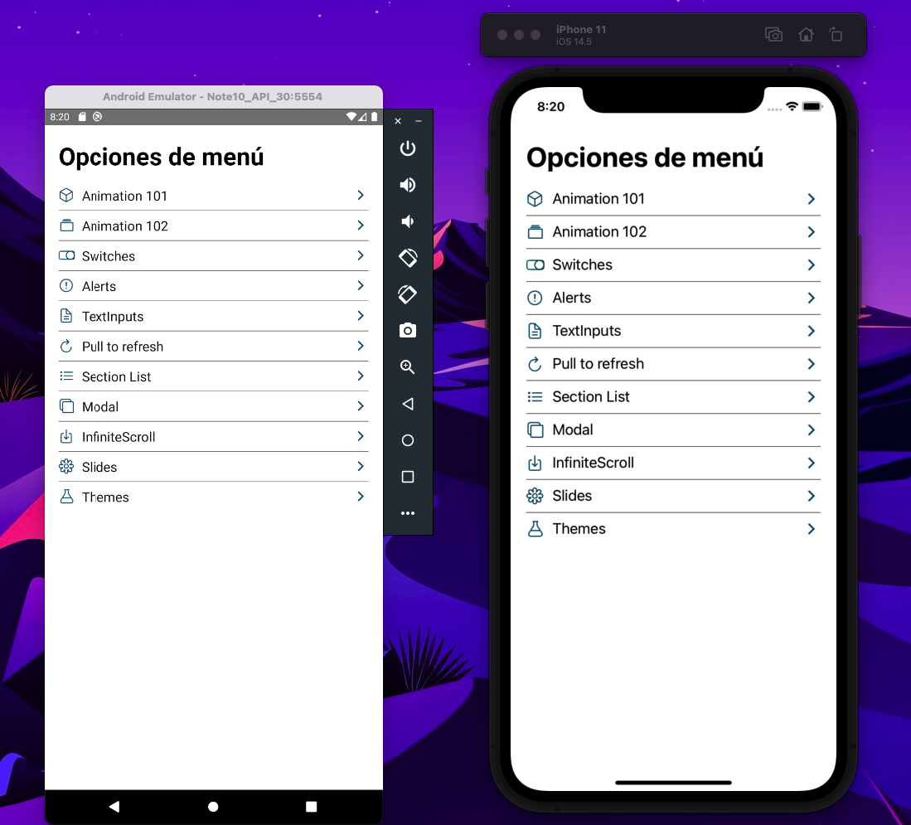

<p align="center">
    <h1>Componentes en React Native</h1>
</p>

# Install
```
step 1 - yarn install
step 2 - npx pod-install  
step 3 - npx react-native run-android 
step 4 - npx react-native run-ios 
```
## App Components made in React Native, from Fernando Herrara's course in which I learned concepts such as:
* Animation
* FlatList (Standard & group)
* Modal
* Alert
* Switches
* keyboard
* Images
* FadeInImage
* SlidesHow
* Theme Dark, Light


-----------------------------------------
## Español
## Componentes App realizada en React Native , del curso de Fernando Herrara en el cual aprendí conceptos como:
* Animaciones
* FlatList (Normales y agrupadas)
* Modal
* Alertas
* FadeIn y FadeOut animacion
* Switches
* Imagenes
* FadeInImage
* SlidesHow
* Theme Dark, Light



# Video demostración:
[Youtube](https://www.youtube.com/watch?v=Bgb82cCue1g)


## Mi canal de youtube 

[Youtube](https://www.youtube.com/channel/UCQsrs_h91Q-baLx-n_rcdNg)

## Mis articulos en medium
[medium](https://devjaime.medium.com/)


## Mi twitter por si quieres contacterme
[medium](https://twitter.com/HsJhernandez)

### :heart: ¿Te gusto este proyecto?

Si te gusto este proyecto comparte y dale una estrella :star: en Github y no dudes en contactarme.